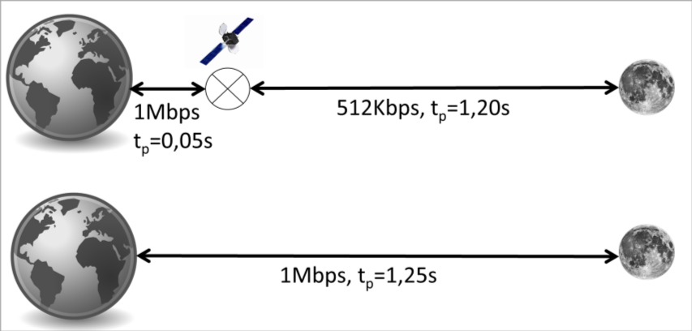
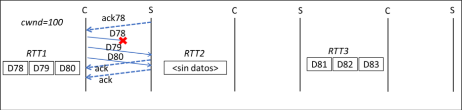

## Aplicaciones Telemáticas <!-- omit in toc -->

# Midterm 1

*Año académico 2019-20*

## Instrucciones <!-- omit in toc -->

Tiempo disponible: 90 min

Explica **clara y brevemente** todo paso que des considerando que una respuesta
correcta sin explicación no necesariamente puntúa. Responde en hojas de examen.
Debes entregar este enunciado (se publicarán las soluciones). Indica
explícitamente cualquier suposición que hagas, aunque, en general, puedes
suponer lo siguiente:

* el emisor envía siempre todos los segmentos de la ventana o los que se
  indiquen (usando segmentos de MSS Bytes de longitud) antes de recibir el ACK
  que asiente el primer segmento enviado en dicha ventana
* los segmentos se asienten individualmente

> **Nota**
>
> Respuestas de estudiante. Las respuestas proporcionadas no son necesariamente
> correctas a menos que se indique lo contrario.

## Tabla de Contenido <!-- omit in toc -->

* [Problema](#problema)
    * [Pregunta 1.1 ✓](#pregunta-11-)
    * [Pregunta 1.2 ✓](#pregunta-12-)
    * [Pregunta 1.3 ╱](#pregunta-13-)
    * [Pregunta 1.4 ╱](#pregunta-14-)
    * [Pregunta 1.5 ✓](#pregunta-15-)
    * [Pregunta 1.6 ✓](#pregunta-16-)
* [Cuestión](#cuestión)
    * [Pregunta 2.1 ✓](#pregunta-21-)

---

## Problema

La Agencia Espacial desea evaluar el uso de TCP con dos tecnologías de
comunicación desde la tierra con su base en la luna para mantener una conexión
persistente (ver imagen ). La primera de las tecnologías conectaría la tierra
con la luna usando un enlace desde la tierra con un satélite de comunicaciones
geoestacionario, donde habría un router, con 1Mbps de velocidad de enlace, y
desde el satélite a la luna otro enlace con 512Kbps de velocidad. El retardo de
propagación sería 0,05s entre la tierra y satélite y 1,20s entre satélite y la
luna.

La segunda tecnología con un enlace de 1Mbps y 1,25s de retardo de transmisión
uniría directamente la tierra con la luna sin mediación de satélites.

La ventana anunciada (`WIN`) para ambos extremos es de 628608 Bytes. El
parámetro Slow Start Threshold (`ssthresh`) es en ambos casos 68754 Bytes. Ambas
tecnologías utilizan una MTU muy grande de 9862 Bytes.

Figura 1: Tecnologías de interconexión Tierra-Luna

### Pregunta 1.1 ✓

Si la conexión estuviese abierta el tiempo suficiente, y en ausencia de
congestión o perdidas, ¿Qué valor máximo podría alcanzar la ventana de
congestión (`cwnd`)? ¿Por qué?

> **Respuesta**
>
> La ventana de congestión (`cwnd`) podría crecer indefinidamente, o hasta que
> alcance el valor máximo que pueda almacenar la implementación, en ausencia de
> congestión o pérdidas.

### Pregunta 1.2 ✓

Si la conexión estuviese abierta el tiempo suficiente, ¿Qué valor máximo podría
alcanzar la ventana efectiva ($V_{ef}$)? ¿Por qué?

> **Respuesta**
>
> La ventana efectiva ($V_{ef}$) se define como el mínimo entre la ventana de
> congestión (`cwnd`) y la ventana del receptor. Ya que la ventana de congestión
> puede crecer indefinidamente, el valor máximo de la ventana efectiva es el
> valor máximo de la ventana del receptor, que es igual a `WIN`: $\boxed{628608
> \text{ B}}$.

### Pregunta 1.3 ╱

Calcula para ambas la ventana que permite el envío continuo (Vec)

> **Respuesta**
>
> El valor de la ventana de envío continuo ($V_{ec}$) se puede calcular usando
> la fórmula:
>
> $$
> \begin{aligned}
>     V_{ec} &= \frac{RTT}{T_{tx}} \\
>     &= \frac{2 ⋅ t_p + T_{tx}}{T_{tx}} \\
>     &= 1 + \frac{2 ⋅ t_p}{T_{tx}} \\
> \end{aligned}
> $$
>
> En el primer caso, el resultado es el siguiente:
>
> $$
> t_p = 1.2 s + 0.05 s = 1.25 s \\[1em]
> \begin{aligned}
>     V_{ec} &= 1 + \frac{2 ⋅ 1.25s}{\frac{9862 \text{ B/seg}}{ 512 \text{ Kbps}}} \\
>     &= 1 + \frac{2.5 s }{0.1541 s/\text{seg}} \\
>     &= 17.22 \text{ seg} \\
>     &\boxed{≈ 17 \text{ seg}}
> \end{aligned}
> $$
>
> En el segundo caso, tenemos lo siguiente:
>
> $$
> t_p = 1.25 s \\[1em]
> \begin{aligned}
>     V_{ec} &= 1 + \frac{2 ⋅ 1.25s}{\frac{9862 \text{ B/seg}}{ 1 \text{ Mbps}}} \\
>     &= 1 + \frac{2.5 s }{78.90 ms/\text{seg}} \\
>     &= 32.68 \text{ seg} \\
>     &\boxed{≈ 33 \text{ seg}}
> \end{aligned}
> $$
>
> > **Nota**
> >
> > La solución propuesta aproxima la ventana de envío continuo del segundo caso
> > a 32 segmentos.

<!-- 
MTU = 9862 B
Rb1 = 512 kb/s
Rb2 = 1 Mb/s
tp1 = 1.2s + 0.05s
tp2 = 1.25 s

Ttx1 = MTU/Rb1
RTT1 = 2 * tp1 + Ttx1
Vec1 = RTT1/Ttx1

Ttx2 = MTU/Rb2
RTT2 = 2 * tp2 + Ttx2
Vec2 = RTT2/Ttx2
-->

### Pregunta 1.4 ╱

¿Cuántos RTTs se tardaría en alcanzar dicha ventana de envío continuo en ambos casos?

> **Respuesta**
>
> Debemos tener en cuenta que en ambos casos el umbral de slow start (`ssthresh`)
> es de 68754 Bytes, que equivale a $\frac{68754 B}{MTU - 40B} = 7$ segmentos.
>
> En ambos casos, `cwnd` empieza con un valor de 1 segmento, y podemos aproximar
> que se duplica en cada RTT hasta llegar a `ssthresh`. A partir de ahí, el
> incremento es lineal, aproximadamente de 1 segmento por RTT.
>
> En ambos casos, `cwnd` alcanza el valor de `ssthresh` en aproximadamente 3 RTTs:
>
> $$
> N_{1→ssthresh} ≈ ⌈ \log_2(7) ⌉ = 3
> $$
>
> A partir de ahí, aproximando el incremento como 1 segmento por RTT, se puede
> calcular el número de RTTs necesarios para alcanzar el valor de $V_{ec}$:
>
> $$
> N_{ssthresh→Vec} = V_{ec} - ssthresh_{seg}
> $$
>
> En el primer caso:
>
> $$
> \begin{aligned}
>     N_{1→Vec} &= N_{1→ssthresh} + N_{ssthresh→Vec} \\
>     &= 3 + (17-7) \\
>     &\boxed{= 13}
> \end{aligned}
> $$
>
> En el segundo caso:
>
> $$
> \begin{aligned}
>     N_{1→Vec} &= N_{1→ssthresh} + N_{ssthresh→Vec} \\
>     &= 3 + (33-7) \\
>     &\boxed{= 29}
> \end{aligned}
> $$
>
> > **Nota**
> >
> > En la solución propuesta del examen se asume que la implementación funciona en
> > *slow start* cuando `cwnd` es igual a `ssthresh`, pero según el
> > [RFC 5681][rfc5681] esto no es necesario y depende de la implementación.

### Pregunta 1.5 ✓

La primera tecnología, la que emplea el satélite, tiene establecido el retardo
de retransmisión (`RTO`) en un `RTT` (RTO = RTT). Considera el caso de la Figura
2 en el que la conexión tiene una ventana de congestión de 100 (`cwnd` = 100)
tras recibir el $ACK_{78}$. En ese momento, en el periodo de tiempo RTT1, se
envían los segmentos $D_{78}$, $D_{79}$ y $D_{80}$ produciéndose un fallo que
impide que llegue el segmento $D_{78}$. En RTT2 no hay datos para enviar. En
RTT3 se deciden enviar los segmentos $D_{81}$, $D_{82}$ y $D_{83}$. Indica
claramente el valor de la ventana de congestión (`cwnd`), el slow start
threshold (`sstresh`) cuando varíen indicando el algoritmo usado para el cálculo
de la ventana o el tipo de congestión que se produce hasta el envío de $D_{83}$.

Figura 2: Intercambio de segmentos

> **Respuesta**
>
> Ya que el tiempo de retransmisión `RTO` es igual a un RTT, la pérdida del
> segmento $D_{78}$ se detecta inmediatamente al terminar el periodo RTT1. En
> ese que se detecta un *timeout*, el algoritmo de control de congestión
> disminuye el valor de la ventana de congestión `cwnd` a su valor inicial de
> **1 segmento**, y el valor de `ssthresh` a la mitad de `FlightSize` (según el
> [RFC 5681][rfc5681]). Sin embargo, aquí utilizaremos una simplificación y
> asignaremos a `ssthresh` el valor del máximo entre $\frac{V_{ef}}{2}$ y
> 2 segmentos, que en este caso se resuelve a $\frac{64}{2} =$ **32 segmentos**
>
> Al inicio del periodo RTT2 se enviará únicamente el segmento $D_{78}$, sin más
> datos durante el resto del periodo.
>
> Los ACKS de $D_{79}$ y $D_{80}$ serán ACKs duplicados, iguales que $ACK_{78}$,
> y el cliente los detectará como tales. Sin embargo, estos corresponden a un
> segmento que ya se ha reenviado, por lo que no se tendrían en cuenta aunque
> fueran 3 ACKs duplicados (suficientes para determinar una pérdida). Además, al
> tratarse de una retransmisión por *timeout*, **no** se trabajará en *fast
> retransmit / fast recovery*.
>
> Al final del periodo RTT2, se recibirá un ACK correspondiente a la llegada de
> $D_{78}$, el cual reconocerá los 3 segmentos anteriores: $ACK_{81}$. El valor
> de la ventana de congestión aumentará en modo *slow start*, aumentando en 1
> segmento y alcanzando un valor de `cwnd` = 2.
>
> Durante el periodo RTT3, se enviarán los segmentos $D_{81}$, $D_{82}$ y
> $D_{83}$, cada uno provocando la salida y llegada de su ACK correspondiente
> sin que expire `RTO`. El valor de la ventana de congestión aumentará en modo
> *slow start*, aumentando en 1 segmento por cada ACK recibido, y alcanzando un
> valor de `cwnd` = 5.

### Pregunta 1.6 ✓

¿Qué valor de RTO mejoraría la conexión considerando un tráfico similar al de la
pregunta anterior? ¿por qué? Calcula los valores de la ventana de congestión
(`cwnd`), el slow start threshold (`sstresh`) cuando varíen indicando el
algoritmo usado para el cálculo de la ventana o el tipo de congestión que se
produce hasta el envío de $D_{83}$ en ese caso.

> **Respuesta**
>
> Si el valor de `RTO` fuera de al menos 3 RTTs, al llegar el tercer ACK
> duplicado (provocado por la llegada del segmento $D_{81}$) en el final del
> periodo RTT3, se entraría en modo *fast retransmit / fast recovery*.
>
> En este caso, el valor del umbral de *slow start* (`ssthresh`) se establece en
> la mitad de la ventana efectiva (por simplificación en lugar de `FlightSize`),
> que en este caso sería igual al caso anterior (**32 segmentos**). Sin embargo,
> el valor de la ventana de congestión (`cwnd`) se establecería en el mismo
> valor de `ssthresh` + 3 segmentos = **35 segmentos**.
>
> Además, los segmentos $D_{82}$ y $D_{83}$ generarían más ACKs duplicados, y
> `cwnd` aumentaría en 1 segmento por cada ACK duplicado recibido, llegando a un
> valor de **37 segmentos**
>
> Por último, al final del periodo RTT4 (1 RTT tras el reenvío de $D_{78}$), la
> ventana de congestión `cwnd` se *desinflaría* y volvería al valor de
> `ssthresh`: **32 segmentos**.

## Cuestión

### Pregunta 2.1 ✓

¿Cuántos registros (RR) y de qué tipo de los que conoces (SoA, MX, NS, A),
podrían encontrarse en un nodo del árbol que sabemos que es una zona (ha sido
delegado por el nivel superior)?

> **Respuesta**

Las cantidades se encuentran a continuación

| Registro | Cantidad | Nota                                                        |
| -------- | -------- | ----------------------------------------------------------- |
| SoA      | $1$      | Debe tener un registro SoA que indica la delegación         |
| MX       | $≥0$     | No es obligatorio tener servidores de email                 |
| NS       | $≥2$     | Debe haber al menos uno primario y uno o más secundarios    |
| A        | $≥0$     | No es necesario que el nodo del árbol tenga los registros A |

[rfc5681]: https://doi.org/10.17487/RFC5681
